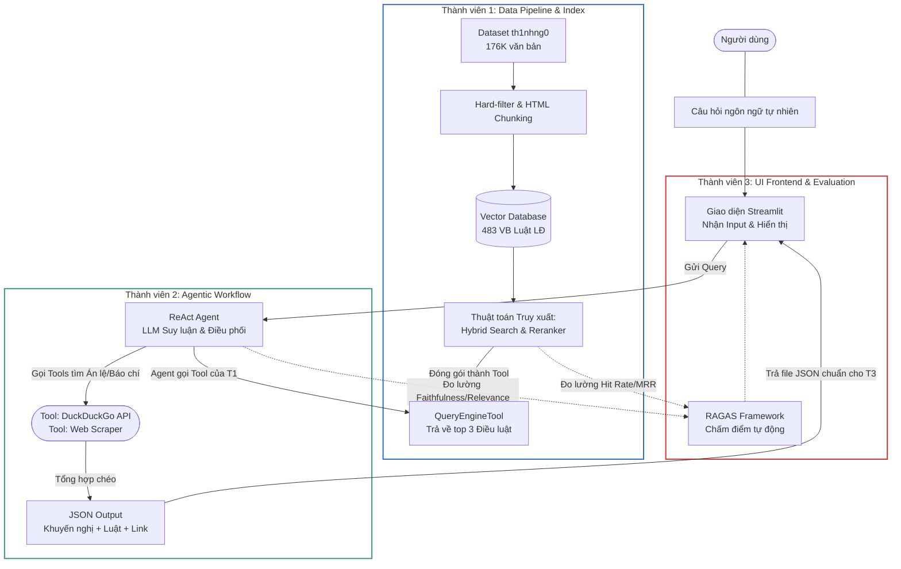

Thành viên 1: Viên - Data & Retrieval Engineer (LlamaIndex)
Vai trò: Chuyên trị cụm "R" (Retrieval - Tìm kiếm). Xử lý data và xây dựng thuật toán truy xuất cốt lõi.

Nhiệm vụ Data Pipeline: Tiền xử lý dataset th1nhng0, lọc 52% văn bản hết hiệu lực. Dùng BeautifulSoup bóc tách HTML, sau đó dùng các hàm của LlamaIndex tạo thành các Document và Node chuẩn.

Nhiệm vụ Retrieval (LlamaIndex): Xây dựng luồng tìm kiếm nâng cao. Khởi tạo VectorStoreIndex (lưu vào ChromaDB). Code thuật toán Hybrid Search (Dense + BM25) và Cross-Encoder Reranking bằng thư viện của LlamaIndex.

Sản phẩm bàn giao: Đóng gói toàn bộ cục code truy xuất này thành một Tool (Ví dụ: QueryEngineTool của LlamaIndex) nhận câu hỏi và nhả ra 3 Điều luật chính xác nhất. Đưa Tool này cho T2.

Thành viên 2: Đạt - AI Agent Engineer (LlamaIndex)
Vai trò: Chuyên trị cụm "A & G" (Agent & Generation). Tạo "Não bộ" suy luận và gọi công cụ.

Nhiệm vụ Agent & Generation: Khởi tạo LLM (OpenAI/Groq). Viết System Prompt định hình tư duy của Agent (ReAct Prompting).

Nhiệm vụ Tool Calling: Tự code Tool số 2 (DuckDuckGo Search) và Tool số 3 (Web Scraper) để quét báo chí thực tế.

Sản phẩm bàn giao: Nhận QueryEngineTool từ T1, ráp chung với 2 Tools vừa viết, sau đó khởi tạo ReActAgent của LlamaIndex. Đảm bảo Agent biết lúc nào nên tìm luật, lúc nào nên đọc báo chí. Xuất ra file API/Hàm xử lý cuối cùng cho T3.

Thành viên 3: Hiếu - QA, Evaluation & Frontend Developer
Vai trò: Bảo chứng chất lượng, đo lường các chỉ số và dựng giao diện.vs

Nhiệm vụ Evaluation: Viết 30-50 câu hỏi Ground Truth. Đo lường Hit Rate/MRR cho hàm Retrieval của T1. Dùng RAGAS (framework này hỗ trợ LlamaIndex rất tốt) chấm điểm luồng Agent của T2.

Nhiệm vụ UI: Dựng giao diện Chatbot bằng Streamlit, hiển thị rõ 3 phần Output (Khuyến nghị, Luật, Thực tiễn) để thầy giáo chấm điểm. Nhận JSON từ T2 để đổ lên giao diện.

🗓️ Tuần 1: Setup & Code Độc Lập
T1: Lọc sạch HTML, Hard-Filter văn bản luật. Xuất 1 file Mock Data (csv/json chứa 10 luật).
T2: Setup môi trường LlamaIndex. Dùng Mock Data của T1 để test thử việc khởi tạo ReActAgent cơ bản.
T3: Lên list 50 câu hỏi test. Chốt cấu trúc file JSON truyền tải giữa backend và frontend. Dựng trước layout Streamlit.

🗓️ Tuần 2: Ráp nối Retrieval & Tools
T1: Code xong Vector DB (ChromaDB). Viết xong hàm Hybrid Search + Reranking bằng LlamaIndex. Chạy mượt cục Retrieval.
T2: Hoàn thiện code Tools tìm kiếm báo chí, đọc URL.
T3: Cầm hàm Retrieval của T1 chạy test Hit Rate/MRR ngay và luôn. Báo lỗi nếu tìm luật quá sai.
→ Present giữa kì kết quả sơ bộ

🗓️ Tuần 3: Hợp Thể Agentic RAG
T1 & T2: Pair-programming (Code chung). T1 ném hàm QueryEngineTool qua cho T2. T2 nhét vào Agent. Test xem Agent có suy luận mượt mà đa nguồn không.

T3: Gắn backend hoàn thiện vào Streamlit. Chuẩn bị script RAGAS.

🗓️ Tuần 4: Đánh Giá & Tinh Chỉnh (Tuning)
T3: Chạy bộ test 50 câu qua hệ thống Agent hoàn chỉnh. Chấm điểm Faithfulness và Answer Relevance. Gửi danh sách các câu Agent bị "ảo giác" cho T2.

T2: Tinh chỉnh System Prompt, ép Agent không được bịa luật hoặc dùng sai Tool.

T1: Đóng gói thư viện (requirements.txt), chuẩn bị Data cho slide báo cáo.

🗓️ Tuần 5: Đóng Gói & Tổng Duyệt
Tổng duyệt giao diện Streamlit, fix bug hiển thị.

Quay video demo luồng xử lý suy luận (Reasoning) của LlamaIndex trên terminal.

Hoàn thiện Slide và Báo cáo Giai đoạn 2.
