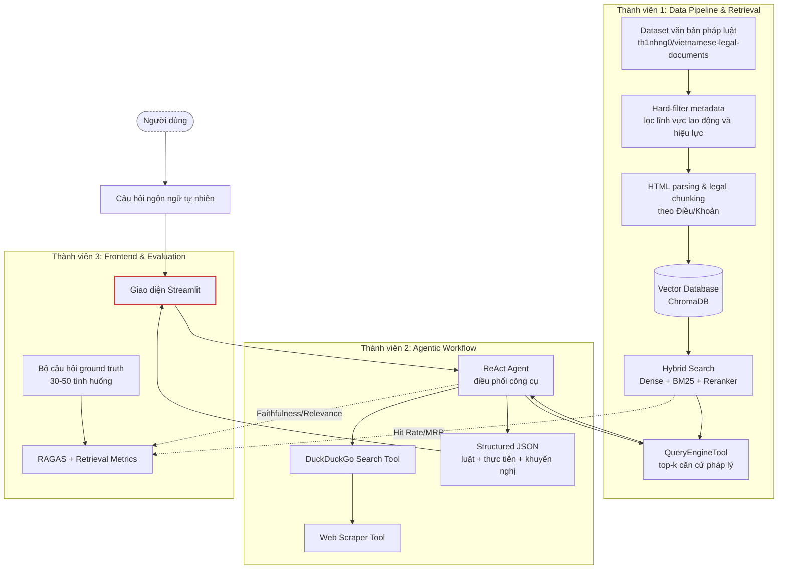

# Kế hoạch triển khai dự án

**Đề tài:** Hệ thống hỗ trợ tư vấn pháp lý và khuyến nghị hướng xử lý tình huống Luật Lao động Việt Nam dựa trên RAG đa nguồn  
**Môn học:** Hệ hỗ trợ ra quyết định  
**Nhóm:** Nhóm 5

## 1. Kiến trúc tổng quan



## 2. Phân công nhiệm vụ

### Thành viên 1: Viên - Data & Retrieval Engineer

Vai trò chính của Thành viên 1 là xây dựng phần dữ liệu và truy xuất, tức thành phần "Retrieval" của hệ thống.

Nhiệm vụ:

- Tiền xử lý dataset `th1nhng0/vietnamese-legal-documents`.
- Lọc văn bản thuộc lĩnh vực lao động và ưu tiên văn bản còn hiệu lực.
- Dùng BeautifulSoup để bóc tách HTML và chia văn bản theo cấu trúc pháp lý như Điều, Khoản.
- Lưu metadata quan trọng cho mỗi chunk: tên văn bản, số hiệu, điều khoản, trạng thái hiệu lực, ngày ban hành.
- Xây dựng VectorStoreIndex với ChromaDB.
- Triển khai truy xuất nâng cao bằng Hybrid Search, kết hợp dense retrieval, BM25 và reranking.
- Đóng gói module truy xuất thành `QueryEngineTool` để Agent có thể gọi.

Sản phẩm bàn giao:

- Pipeline tiền xử lý dữ liệu.
- Vector database cho văn bản Luật Lao động.
- Hàm hoặc tool truy xuất trả về top-k điều luật liên quan.
- Kết quả thử nghiệm Hit Rate/MRR ban đầu.

### Thành viên 2: Đạt - AI Agent Engineer

Vai trò chính của Thành viên 2 là xây dựng phần Agent và sinh câu trả lời cuối cùng.

Nhiệm vụ:

- Khởi tạo LLM thông qua OpenAI, Groq hoặc mô hình tương đương.
- Thiết kế system prompt cho Agent, nhấn mạnh yêu cầu không bịa căn cứ pháp lý và phải trích dẫn nguồn.
- Nhận `QueryEngineTool` từ Thành viên 1 và tích hợp vào Agent.
- Xây dựng DuckDuckGo Search Tool để tìm tình huống thực tế liên quan.
- Xây dựng Web Scraper Tool để đọc nội dung từ URL phù hợp.
- Thiết kế luồng Agentic RAG: phân tích tình huống, gọi công cụ luật, gọi công cụ web nếu cần, tổng hợp output.
- Chuẩn hóa output dưới dạng JSON để giao diện dễ hiển thị.

Sản phẩm bàn giao:

- Module Agentic RAG hoàn chỉnh.
- Các tool web search và web scraper.
- File API hoặc hàm xử lý nhận câu hỏi và trả về JSON.
- Prompt và quy tắc kiểm soát hallucination.

### Thành viên 3: Hiếu - QA, Evaluation & Frontend Developer

Vai trò chính của Thành viên 3 là đánh giá chất lượng hệ thống và xây dựng giao diện demo.

Nhiệm vụ:

- Xây dựng bộ 30-50 câu hỏi ground truth thuộc các tình huống lao động phổ biến.
- Gắn nhãn điều luật kỳ vọng cho từng câu hỏi để đánh giá retrieval.
- Đo Hit Rate và MRR cho module truy xuất của Thành viên 1.
- Dùng RAGAS để đánh giá Faithfulness và Answer Relevance của câu trả lời.
- Thiết kế giao diện Streamlit để người dùng nhập tình huống và xem kết quả.
- Hiển thị output theo các phần: tóm tắt tình huống, căn cứ pháp lý, ví dụ thực tiễn, khuyến nghị.
- Ghi nhận lỗi thường gặp của hệ thống và phối hợp với Thành viên 1, 2 để tinh chỉnh.

Sản phẩm bàn giao:

- Bộ câu hỏi đánh giá và ground truth.
- Script đánh giá định lượng.
- Giao diện Streamlit.
- Bảng kết quả so sánh RAG truyền thống và Agentic RAG.

## 3. Chuẩn output JSON giữa backend và frontend

Backend nên trả về một cấu trúc JSON thống nhất để Streamlit dễ hiển thị và để nhóm dễ đánh giá.

```json
{
  "case_summary": "Tóm tắt ngắn gọn tình huống người dùng",
  "legal_issues": [
    "Vấn đề pháp lý 1",
    "Vấn đề pháp lý 2"
  ],
  "legal_basis": [
    {
      "document_name": "Tên văn bản",
      "article": "Điều/Khoản",
      "effective_status": "Còn hiệu lực",
      "excerpt": "Trích đoạn liên quan",
      "source": "Nguồn văn bản nếu có"
    }
  ],
  "practical_references": [
    {
      "title": "Tiêu đề bài viết",
      "url": "https://example.com",
      "summary": "Tóm tắt tình huống thực tế"
    }
  ],
  "recommendations": [
    {
      "option": "Thương lượng với công ty",
      "when_to_use": "Khi tranh chấp còn có thể giải quyết nội bộ",
      "suggested_steps": [
        "Chuẩn bị hợp đồng, bảng lương, email, tin nhắn liên quan",
        "Gửi yêu cầu bằng văn bản"
      ]
    }
  ],
  "limitations": "Thông tin chỉ mang tính tham khảo, không thay thế tư vấn pháp lý chính thức."
}
```

## 4. Kế hoạch theo tuần

### Tuần 1: Chuẩn bị dữ liệu, giao diện và bộ đánh giá

Thành viên 1:

- Lọc dữ liệu theo lĩnh vực lao động.
- Kiểm tra trạng thái hiệu lực và loại bỏ văn bản không phù hợp.
- Tạo mock data gồm khoảng 10-20 văn bản hoặc điều luật mẫu để nhóm test sớm.

Thành viên 2:

- Setup môi trường LlamaIndex và LLM.
- Tạo Agent thử nghiệm với mock data.
- Viết bản nháp system prompt và format JSON output.

Thành viên 3:

- Xây dựng danh sách 30-50 câu hỏi test.
- Chốt schema JSON giữa backend và frontend.
- Dựng layout Streamlit ban đầu.

Kết quả cuối tuần:

- Có mock data, giao diện khung, Agent thử nghiệm và bộ câu hỏi đánh giá bản đầu.

### Tuần 2: Hoàn thiện retrieval và web tools

Thành viên 1:

- Hoàn thành pipeline chunking theo Điều/Khoản.
- Tạo ChromaDB index.
- Triển khai Hybrid Search và reranker.
- Đóng gói `QueryEngineTool`.

Thành viên 2:

- Hoàn thiện DuckDuckGo Search Tool.
- Hoàn thiện Web Scraper Tool.
- Test truy vấn web với một số tình huống lao động phổ biến.

Thành viên 3:

- Chạy đánh giá Hit Rate/MRR cho module retrieval.
- Ghi nhận các câu retrieval sai để Thành viên 1 điều chỉnh.

Kết quả cuối tuần:

- Có retrieval tool dùng được và web tools chạy độc lập.
- Có kết quả sơ bộ để trình bày giữa kỳ.

### Tuần 3: Tích hợp Agentic RAG

Thành viên 1 và Thành viên 2:

- Tích hợp `QueryEngineTool` vào Agent.
- Kiểm tra Agent có gọi đúng công cụ trong các tình huống khác nhau.
- Debug các lỗi truy xuất sai, thiếu nguồn hoặc câu trả lời không đúng format.

Thành viên 3:

- Kết nối backend với Streamlit.
- Chuẩn bị script RAGAS.
- Kiểm tra giao diện hiển thị đầy đủ căn cứ pháp lý, nguồn thực tế và khuyến nghị.

Kết quả cuối tuần:

- Có bản demo end-to-end từ câu hỏi người dùng đến output trên giao diện.

### Tuần 4: Đánh giá và tinh chỉnh

Thành viên 3:

- Chạy toàn bộ bộ test qua RAG truyền thống và Agentic RAG.
- Đo Hit Rate, MRR, Faithfulness, Answer Relevance và latency.
- Tổng hợp các trường hợp hallucination hoặc citation kém.

Thành viên 2:

- Tinh chỉnh system prompt.
- Bổ sung quy tắc buộc Agent từ chối trả lời khi thiếu căn cứ pháp lý.
- Cải thiện format output JSON.

Thành viên 1:

- Điều chỉnh chunking, top-k, reranking hoặc metadata filter nếu retrieval chưa ổn định.
- Chuẩn bị bảng thống kê dữ liệu cho báo cáo.

Kết quả cuối tuần:

- Có bảng so sánh định lượng giữa hai giải pháp.
- Có bản hệ thống ổn định để demo.

### Tuần 5: Đóng gói và hoàn thiện báo cáo

Cả nhóm:

- Fix lỗi giao diện và lỗi hiển thị cuối cùng.
- Quay video demo luồng xử lý.
- Hoàn thiện slide và báo cáo.
- Chuẩn bị phần trình bày: bối cảnh, kiến trúc, dữ liệu, hai giải pháp, đánh giá và bài học rút ra.

Kết quả cuối tuần:

- Sản phẩm demo hoàn chỉnh.
- Slide, báo cáo và video demo sẵn sàng nộp.

## 5. Rủi ro và phương án giảm thiểu

| Rủi ro | Ảnh hưởng | Phương án xử lý |
| --- | --- | --- |
| Dữ liệu có nhiều văn bản hết hiệu lực | Trả lời sai căn cứ pháp lý | Hard-filter metadata, hiển thị trạng thái hiệu lực |
| Chunking làm mất ngữ cảnh điều khoản | Retrieval sai hoặc thiếu căn cứ | Chunk theo Điều/Khoản, lưu metadata đầy đủ |
| Web search trả về nguồn kém tin cậy | Khuyến nghị thiếu kiểm chứng | Ưu tiên báo chính thống, trang pháp luật, luôn kèm URL |
| Agent hallucinate điều luật | Rủi ro cao trong miền pháp lý | Prompt nghiêm ngặt, bắt buộc trích nguồn, cho phép từ chối |
| Latency cao do gọi web | Trải nghiệm chậm | Cache kết quả, giới hạn số URL đọc, so sánh latency trong đánh giá |
| Phạm vi đề tài quá rộng | Khó hoàn thành và khó đánh giá | Giới hạn vào các tình huống lao động phổ biến |

## 6. Tiêu chí hoàn thành

Dự án được xem là hoàn thành khi có đủ các thành phần sau:

- Pipeline dữ liệu pháp luật lao động đã xử lý và lập chỉ mục.
- Baseline RAG truyền thống.
- Agentic RAG đa nguồn.
- Giao diện Streamlit hoạt động end-to-end.
- Bộ câu hỏi ground truth và kết quả đánh giá.
- Bảng so sánh giữa hai giải pháp.
- Báo cáo nêu rõ đóng góp của hệ thống dưới góc nhìn DSS.

## 7. Gợi ý trọng tâm khi trình bày

Khi thuyết trình, nhóm nên nhấn mạnh rằng đây không chỉ là một chatbot pháp luật, mà là một hệ hỗ trợ ra quyết định. Điểm DSS nằm ở việc hệ thống giúp người dùng:

- Nhận diện vấn đề pháp lý trong tình huống.
- Xem căn cứ pháp lý có thể kiểm chứng.
- So sánh các hướng xử lý khả thi.
- Hiểu ví dụ thực tiễn tương tự.
- Ra quyết định với thông tin minh bạch hơn.

Nếu có thời gian, nhóm nên demo cùng một câu hỏi trên hai pipeline. RAG truyền thống sẽ cho thấy câu trả lời thiên về căn cứ pháp luật, còn Agentic RAG sẽ cho thấy giá trị bổ sung qua ví dụ thực tế và khuyến nghị hành động.
